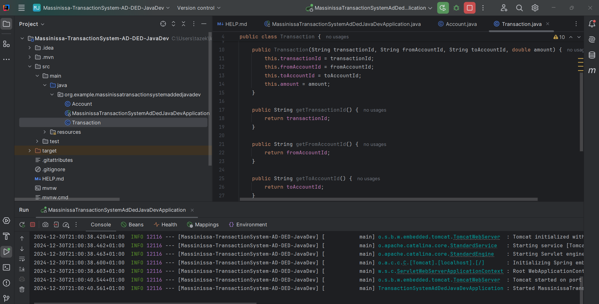
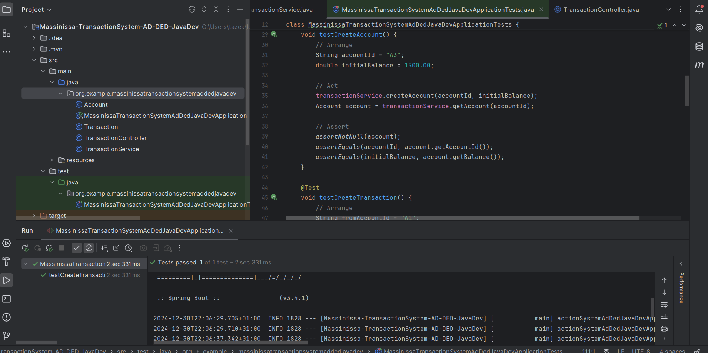

# Money Transaction System API

A simple REST API built with Spring Boot to manage bank accounts and process transactions. This system allows for creating accounts, making transactions, and retrieving transaction logs. The project is designed to simulate money transfers between accounts using a multithreaded approach for transaction processing.


## Features

- **Account Management**:
    - Create new accounts.
    - Retrieve account details.

- **Transaction Management**:
    - Create transactions between accounts.
    - Retrieve the transaction log.

## Technologies Used

- **Spring Boot**: Framework used to build the REST API.
- **Java**: The programming language for building the application.
- **Maven**: Build automation tool.
- **Concurrency**: Multi-threaded transaction processing.

## API Endpoints

### 1. **Account Management**
- `POST /api/accounts`: Create a new account.
    - **Request Parameters**: `accountId`, `initialBalance`
    - Example: `POST /api/accounts?accountId=A1&initialBalance=1000`

- `GET /api/accounts/{accountId}`: Retrieve account details.
    - **Path Variable**: `accountId`
    - Example: `GET /api/accounts/A1`

### 2. **Transaction Management**
- `POST /api/transactions`: Create a new transaction.
    - **Request Body**:
      ```json
      {
        "transactionId": "T1",
        "fromAccountId": "A1",
        "toAccountId": "A2",
        "amount": 200
      }
      ```

- `GET /api/transactions/log`: Retrieve the transaction log.
    - Example: `GET /api/transactions/log`

## Project Structure

```
src/
 └── main/
      ├── java/
      │    └── com/
      │        └── example/
      │            └── transactionapi/
      │                ├── controller/
      │                │   └── TransactionController.java
      │                ├── model/
      │                │   ├── Account.java
      │                │   └── Transaction.java
      │                ├── service/
      │                │   └── TransactionService.java
      │                └── TransactionApiApplication.java
      └── resources/
           └── application.properties
```

## How to Run

1. **Clone the repository**:
   ```bash
   git clone https://github.com/your-username/transaction-api.git
   ```

2. **Navigate to the project directory**:
   ```bash
   cd transaction-api
   ```

3. **Build and run the application**:
   If you're using Maven, run:
   ```bash
   mvn spring-boot:run
   ```

4. The application will start on `http://localhost:8080`.

## Example API Calls

- **Create an Account**:
    - `POST /api/accounts?accountId=A1&initialBalance=1000`
    - Response: `"Account created: A1"`

- **Get Account Details**:
    - `GET /api/accounts/A1`
    - Response:
      ```json
      {
        "accountId": "A1",
        "balance": 1000.0
      }
      ```

- **Create a Transaction**:
    - `POST /api/transactions`
    - Body:
      ```json
      {
        "transactionId": "T1",
        "fromAccountId": "A1",
        "toAccountId": "A2",
        "amount": 200
      }
      ```
    - Response: `"Transaction submitted: T1"`

- **Get Transaction Log**:
    - `GET /api/transactions/log`
    - Response:
      ```json
      [
        "Transaction T1 succeeded."
      ]
      ```

## Concurrency

The transaction system is multithreaded, using an `ExecutorService` with a fixed thread pool to process transactions concurrently. This approach ensures that multiple transactions can be handled simultaneously without blocking each other.

## Future Enhancements

- Integrate a database to persist account and transaction data instead of using in-memory storage.
- Add user authentication and authorization for secure access to the API.
- Implement more advanced transaction validation (e.g., for fraudulent activity).

## Tests

This project includes unit tests to ensure that the application works as expected. These tests cover account creation, transaction processing, and transaction logs.
### Test Coverage
The tests include:
* Account Creation: Ensures that a new account can be created with a specified initial balance.
* Account Retrieval: Verifies that an account's details can be fetched correctly using the account ID.
* Transaction Processing: Ensures that a transaction can be processed successfully between two accounts.
* Balance Update: Verifies that the balances of both accounts are updated correctly after a transaction.
* Insufficient Funds Handling: Checks that transactions are rejected when there are insufficient funds in the source account.


## License

This project is licensed under the MIT License.

BY Massinissa TAZEKRITT
